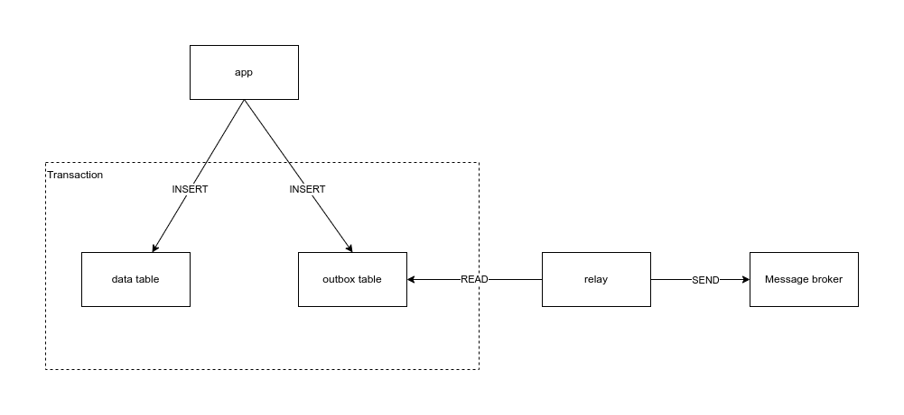

# outbox pattern

The purpose of this repository is to learn and demonstrate how to implement outbox-pattern.

### What is outbox-pattern?

It is and design pattern that lets you atomically save some changes to the database and send message to data broker

### Problem

- If saving data to database is succeeded then message should be sent to message broker
- If commiting transaction with changes fails, then message should not be sent.

### Solution

create additional table "outbox"

Flow:

- additionally to saving changes to database add record to outbox table with information about what should be sent to
  message broker
- separate process reads outbox table and sends message to message broker. 
 

source: https://microservices.io/patterns/data/transactional-outbox.html